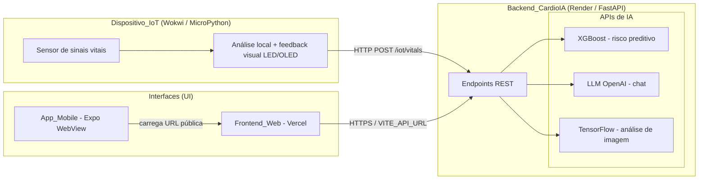
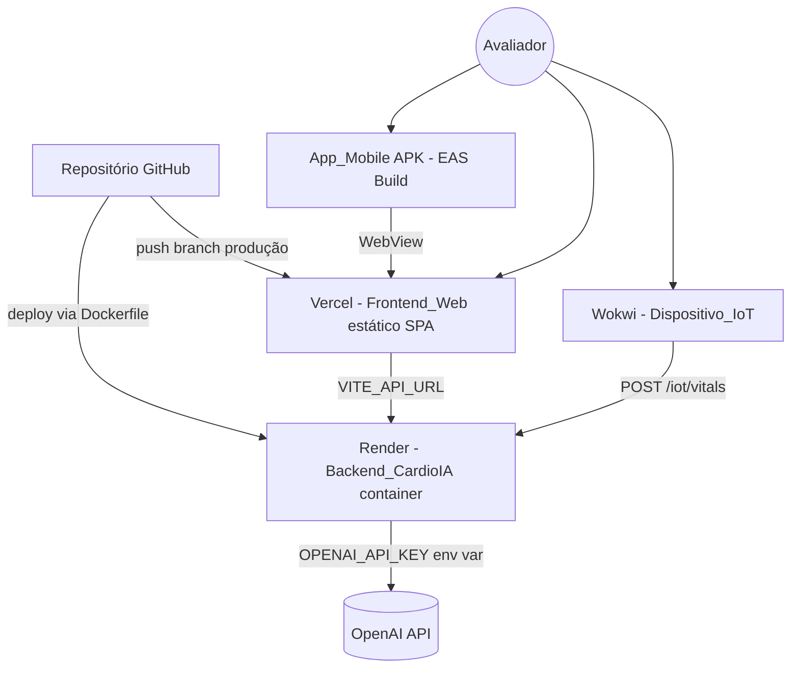

# Documento de Design

## Overview

Este documento descreve o design técnico para a finalização e entrega do MVP da plataforma **CardioIA — Fase 7 (Horizontes Inteligentes)**. O foco está em **fechar as lacunas de entrega** exigidas pela rubrica de avaliação, sem adicionar novas funcionalidades de domínio.

O sistema já existe e está funcional em grande parte:

- **Backend_CardioIA** (`backend/app/`): FastAPI com todos os endpoints exigidos já implementados (`/health`, `/dashboard/summary`, `/patients`, `/patients/{id}`, `/vitals/{id}`, `/risk/{id}`, `/monitoring/summary`, `/chat`, `/iot/vitals`, `/images/analyze`), integrando os três motores de IA: XGBoost (`risk_engine.py`), LLM OpenAI (`chat_engine.py`) e TensorFlow (`image_engine.py`).
- **Frontend_Web** (`frontend/`): React 19 + Vite + React Router 7, consumindo o backend via `cardioService.js`/`api.js`.

O trabalho de design, portanto, concentra-se em quatro frentes:

1. **Publicação profissional** — configuração de deploy do Frontend_Web na Vercel e do Backend_CardioIA no Render (R1, R2).
2. **Empacotamento mobile** — wrapper Expo/WebView e geração de APK via EAS Build (R3).
3. **Pequenas evoluções de frontend e integração** — Login_Mock, fallback para dados mock e exibição de erro do chat (R4, R5.5, R1.6).
4. **IoT, documentação e entregáveis** — evolução do Dispositivo_IoT no Wokwi, diagrama de arquitetura, README, relatório PDF e roteiro de vídeo (R6, R7, R8, R9, R10), além do reforço de segurança da Chave_OpenAI (R11).

### Princípios de Design

- **Escopo mínimo**: nenhum endpoint, motor de IA ou tela nova além do necessário. Reaproveitar o que já existe.
- **Rastreabilidade**: cada decisão de design referencia o requisito correspondente.
- **Segurança de credenciais**: a Chave_OpenAI permanece exclusivamente no backend e fora do versionamento.
- **Resiliência de demonstração**: o Frontend_Web deve degradar graciosamente (dados mock) quando o backend estiver indisponível (cold start do Render).

### Lacunas Identificadas no Código Atual

| Lacuna | Estado atual | Requisito |
|---|---|---|
| Fallback para dados mock | `cardioService.js` propaga o erro; páginas mostram `ErrorState` | R1.6 |
| Login_Mock | Não existe; rotas internas são públicas | R4 |
| Erro descritivo do chat | Backend lança `OpenAIChatError` mas `/chat` não captura → 500 genérico | R5.5 |
| `vercel.json` (SPA rewrite) | Não existe | R1.3, R1.4 |
| App_Mobile (Expo/EAS) | Não existe | R3 |
| Dispositivo_IoT (Wokwi) | Não existe no repositório | R6 |
| CORS para domínio Vercel | CORS fixo em localhost | R2.4 |
| Diagrama, README Fase 7, PDF, roteiro | Pendentes | R7, R8, R9, R10 |

## Architecture

### Visão Geral do Fluxo de Dados (R7)

O diagrama final representa a sequência exigida: **Sensor → MicroPython → Backend Python → APIs de IA → UI**.



### Topologia de Implantação



### Decisões de Arquitetura

| Decisão | Justificativa |
|---|---|
| Frontend estático na Vercel com rewrite SPA | React Router usa `BrowserRouter`; rotas profundas (`/patients`) precisam servir `index.html` para evitar 404 (R1.3, R1.4). |
| Backend em container Render via Dockerfile existente | Reuso do `backend/Dockerfile` já validado; sem reescrita de infraestrutura (R2.2). |
| App_Mobile como WebView | Estratégia de menor esforço para entregar APK que reflete o Frontend_Web sem duplicar a UI (R3.1, R3.5). |
| Login_Mock apenas no cliente | A rubrica exige demonstrar o fluxo de login, não autenticação real; evita backend de auth (R4.1). |
| Chave_OpenAI somente no backend | Evita exposição de credencial no bundle do frontend (R11.1). |
| Fallback para mocks no `cardioService` | Garante demonstração mesmo durante cold start do Render free tier (R1.6, R2.5). |

## Components and Interfaces

### 1. Configuração de Deploy do Frontend (R1)

**`frontend/vercel.json`** — novo arquivo de configuração de rewrite SPA:

```json
{
  "rewrites": [{ "source": "/(.*)", "destination": "/index.html" }]
}
```

- Build command: `npm run build`; output: `dist/`.
- Variável de ambiente na Vercel: `VITE_API_URL` = URL pública do Render (R1.5).
- CI/CD: integração Git nativa da Vercel — push na branch de produção dispara build/deploy (R1.2).

### 2. Configuração de Deploy do Backend (R2)

- Serviço Render do tipo **Web Service / Docker**, apontando para `backend/Dockerfile` (R2.2).
- Variável de ambiente do serviço: `OPENAI_API_KEY` (e opcionalmente `OPENAI_MODEL`) — nunca versionada (R2.x, R11.4).
- Health check: `GET /health` → `{"status": "ok"}` (R2.3, já implementado).

**Atualização de CORS em `backend/app/main.py`** (R2.4): a lista de `allow_origins` deve incluir o domínio público da Vercel. Para suportar previews da Vercel sem editar código a cada deploy, usar `allow_origin_regex`:

```python
app.add_middleware(
    CORSMiddleware,
    allow_origins=[
        "http://localhost:5173",
        "http://127.0.0.1:5173",
        "http://localhost:8081",
        "http://127.0.0.1:8081",
    ],
    allow_origin_regex=r"https://.*\.vercel\.app",
    allow_credentials=True,
    allow_methods=["*"],
    allow_headers=["*"],
)
```

### 3. App_Mobile (R3)

Novo diretório `mobile/` (Expo). Componentes:

- **`App.js`**: tela única com `react-native-webview` carregando `https://<frontend>.vercel.app`.
- **`app.json`**: campo `expo.android.package` em domínio invertido (ex.: `br.com.fiap.cardioia`) (R3.2).
- **`eas.json`**: perfil `preview` com `android.buildType = "apk"` (R3.3, R3.4).

```json
// eas.json (trecho)
{
  "build": {
    "preview": {
      "android": { "buildType": "apk" }
    }
  }
}
```

Interface de uso: o APK gerado pelo EAS Build é disponibilizado por link/QR Code ao Avaliador (R3.6, R8.3).

### 4. Login_Mock no Frontend (R4)

Novos artefatos no Frontend_Web:

- **`src/context/AuthContext.jsx`**: provê `{ isAuthenticated, login(credentials), logout() }`. Estado persistido em `sessionStorage` (chave `cardioia_auth`).
- **`src/pages/Login.jsx`**: formulário de credenciais que chama `login()` (R4.2).
- **`src/components/common/ProtectedRoute.jsx`**: wrapper que redireciona para `/login` quando `!isAuthenticated` (R4.3).
- **Botão de logout** no `Header`/`Sidebar` que chama `logout()` e redireciona para `/login` (R4.4).

Atualização de rotas em `App.jsx`:

```jsx
<Routes>
  <Route path="/login" element={<Login />} />
  <Route path="/" element={<ProtectedRoute><MainLayout /></ProtectedRoute>}>
    <Route index element={<Dashboard />} />
    {/* demais rotas internas */}
  </Route>
</Routes>
```

O Login_Mock não valida credenciais contra backend; qualquer submissão válida (campos preenchidos) concede acesso, cumprindo o caráter demonstrativo (R4.1).

### 5. Camada de Serviço com Fallback (R1.6, R5)

A função-chave é a integração resiliente. O `cardioService.js` será envolvido por uma estratégia try/backend → catch/mock, reusando os arquivos já existentes em `src/data/`.

```javascript
// padrão aplicado a cada chamada
export async function getPatients() {
  try {
    const response = await api.get("/patients");
    return response.data;
  } catch {
    return mockPatients; // src/data/mockPatients.js
  }
}
```

Mapeamento de fallback:

| Serviço | Mock de fallback |
|---|---|
| `getDashboardSummary` | derivado de `mockPatients` |
| `getPatients` / `getPatientById` | `mockPatients` |
| `getMonitoringSummary` / vitals | `mockVitals` |
| `risk` | `mockRisk` |
| `sendChatMessage` | `mockChat` |

Os endpoints de IA permanecem inalterados (R5.1–R5.4 já atendidos pelo backend). A chamada de imagem (`/images/analyze`) e chat continuam consumindo o backend público.

### 6. Tratamento de Erro do Chat (R5.5)

O backend já lança `OpenAIChatError` em `chat_engine.py`, mas o handler `/chat` não o captura, resultando em HTTP 500 genérico. O design adiciona captura explícita:

```python
from .chat_engine import OpenAIChatError

@app.post("/chat", response_model=ChatResponse)
async def post_chat(payload: ChatRequest):
    try:
        reply = chat_engine.get_chat_reply(payload.message)
    except OpenAIChatError as exc:
        raise HTTPException(status_code=502, detail=str(exc)) from exc
    return {"reply": reply}
```

Assim, chave inválida ou indisponibilidade da OpenAI produz uma mensagem de erro descritiva ao cliente (R5.5).

### 7. Dispositivo_IoT no Wokwi (R6)

Novo diretório `iot/` com:

- **`main.py`** (MicroPython): loop de leitura simulada de sinais vitais (FC, SpO2, PA sistólica) a partir de um sensor (ex.: potenciômetro/DHT mapeado) (R6.1).
- **Análise local**: classifica cada leitura como normal/alterada com base em faixas (ex.: `spo2 < 92`, `heart_rate > 110`) (R6.2).
- **Feedback visual**: aciona LED (ou OLED) quando fora da faixa (R6.3).
- **Envio HTTP**: `urequests.post(f"{API_URL}/iot/vitals", json=payload)` ao final de cada ciclo (R6.4). Payload compatível com `IoTVitalIn` (`patient_id`, `heart_rate`, `spo2`, `systolic_bp`, `timestamp` opcional).
- **`diagram.json`** + link público do projeto Wokwi (R6.5).

### Resumo de Endpoints do Backend (já implementados)

| Método | Rota | Modelo de resposta | Requisito |
|---|---|---|---|
| GET | `/health` | `{status}` | R2.3 |
| GET | `/dashboard/summary` | `DashboardSummary` | R5.1 |
| GET | `/patients` | `list[Patient]` | R5.1 |
| GET | `/patients/{id}` | `Patient` (404 se ausente) | R5.1 |
| GET | `/vitals/{id}` | `list[Vital]` | R5.1 |
| GET | `/risk/{id}` | `Risk` (XGBoost) | R5.3 |
| GET | `/monitoring/summary` | `MonitoringSummary` | R5.1 |
| POST | `/chat` | `ChatResponse` (LLM) | R5.2, R5.5 |
| POST | `/iot/vitals` | `Vital` | R6.4 |
| POST | `/images/analyze` | `ImageAnalysisResponse` (TensorFlow) | R5.4 |

## Data Models

Os modelos de dados existentes (`backend/app/models.py`) **não mudam**. Resumo para referência:

- **Patient**: `{ id, name, age, gender, status, diagnosis }`
- **Vital**: `{ id, heart_rate, spo2, systolic_bp, timestamp }`
- **Risk**: `{ patient_id, score, level, reason }` — `level ∈ {alto, moderado, bajo}`
- **DashboardSummary**: `{ total_patients, critical_patients, moderate_patients }`
- **MonitoringSummary**: `{ avg_heart_rate, avg_spo2, avg_systolic_bp, latest_records[] }`
- **ChatRequest/ChatResponse**: `{ message }` / `{ reply }`
- **IoTVitalIn**: `{ patient_id, heart_rate, spo2, systolic_bp, timestamp? }`
- **ImageAnalysisResponse**: `{ label, probability }`

### Novos Modelos (somente frontend)

**Estado de autenticação (Login_Mock)** — não persiste no backend:

```typescript
AuthState = {
  isAuthenticated: boolean
  // persistido em sessionStorage: "cardioia_auth"
}
```

**Payload do IoT** (alinhado a `IoTVitalIn`):

```json
{ "patient_id": 1, "heart_rate": 122, "spo2": 89, "systolic_bp": 85, "timestamp": "2026-05-24T10:00:00" }
```

## Error Handling

| Cenário | Componente | Tratamento | Requisito |
|---|---|---|---|
| Backend indisponível (cold start Render) | Frontend `cardioService` | `try/catch` retorna dados mock de `src/data/` | R1.6, R2.5 |
| Paciente inexistente | Backend | HTTP 404 `Paciente nao encontrado` (já implementado) | R5.1 |
| Chave OpenAI inválida / OpenAI fora do ar | Backend `/chat` | Captura `OpenAIChatError` → HTTP 502 com mensagem descritiva | R5.5 |
| Imagem inválida no upload | Backend `/images/analyze` | HTTP 400 (já implementado) | R5.4 |
| Falha ao carregar modelos de IA (`.pkl`/`.h5`) | Backend engines | Fallback de probabilidade padrão (já implementado em `risk_engine`/`image_engine`) | R5.3, R5.4 |
| Rota interna acessada sem login | Frontend `ProtectedRoute` | Redireciona para `/login` | R4.3 |
| Rota profunda acessada diretamente na Vercel | `vercel.json` rewrite | Serve `index.html` (status 200) | R1.4 |
| Sinal vital fora da faixa | Dispositivo_IoT | Aciona feedback visual (LED/OLED) | R6.3 |
| Falha de rede no envio IoT | Dispositivo_IoT | Captura exceção de `urequests`, registra e segue para o próximo ciclo | R6.4 |

## Testing Strategy

### Avaliação de Aplicabilidade de Property-Based Testing (PBT)

Foi avaliado se o teste baseado em propriedades (PBT) se aplica a esta feature. **PBT NÃO é adequado** para este escopo, pelos seguintes motivos:

- O trabalho é predominantemente de **entrega e integração**: configuração de deploy (Vercel/Render/EAS — equivalente a Infraestrutura como Configuração), empacotamento mobile (WebView), renderização de UI (Login_Mock, fallback) e documentação (diagrama, README, PDF, roteiro). Essas categorias são explicitamente inadequadas para PBT.
- A lógica de domínio (motores XGBoost, LLM e TensorFlow) **já existe e não será modificada** — a rubrica proíbe novas funcionalidades de domínio. Não há novas funções puras com propriedades universais a verificar.
- Os comportamentos a validar (deploy acessível, APK instalável, login mock, fallback, envio IoT, CORS) não variam de forma significativa com entradas geradas aleatoriamente; são verificações de configuração e integração com 1–3 exemplos representativos.

Portanto, a seção **Correctness Properties foi omitida** e a estratégia usa testes de exemplo, integração e smoke.

### Abordagem de Testes

**Smoke tests (configuração / setup):**
- `GET /health` na URL pública do Render retorna 200 (R2.3).
- Build do Frontend_Web (`npm run build`) conclui sem erros e gera `dist/`.
- EAS Build com perfil `preview` produz APK instalável (verificação manual — R3.4).
- APK aberto exibe o Frontend_Web da Vercel (verificação manual em dispositivo — R3.5).

**Integration tests (backend + integração externa, 1–3 exemplos):**
- Cada endpoint REST (`/patients`, `/patients/{id}`, `/vitals/{id}`, `/risk/{id}`, `/dashboard/summary`, `/monitoring/summary`) responde 200 com o schema esperado e 404 quando o paciente não existe (R5.1).
- `POST /chat` com `OPENAI_API_KEY` válida retorna `reply` textual (R5.2); com chave inválida retorna 502 com mensagem descritiva (R5.5).
- `GET /risk/{id}` retorna `level ∈ {alto, moderado, bajo}` (R5.3).
- `POST /images/analyze` com imagem válida retorna `{label, probability}`; com arquivo não-imagem retorna 400 (R5.4).
- `POST /iot/vitals` adiciona um registro de vital e o retorna (R6.4).
- Reaproveitar e estender `backend/test_smoke.py` com `fastapi.testclient`.

**Example/UI tests (frontend):**
- Acesso a rota interna sem login redireciona para `/login`; após `login()`, acessa a rota (R4.2, R4.3).
- `logout()` retorna à tela de login (R4.4).
- Com backend mockado indisponível (erro forçado em `api`), `cardioService` retorna dados mock e a página renderiza sem `ErrorState` (R1.6).
- `vercel.json` valida o rewrite (verificação de configuração / deploy preview — R1.3, R1.4).

**Verificações manuais de deliverables (documentação):**
- README contém URL da Vercel, link/QR do APK, diagrama, prints dos deploys, instruções locais e link do Wokwi (R8).
- Relatório PDF ≤ 5 páginas com diagrama, fluxo de dados e integrantes (R9).
- Roteiro de vídeo ≤ 5 min cobrindo login, navegação, chat, risco, imagem, IoT e App_Mobile (R10).

**Segurança (R11):**
- Verificar que `OPENAI_API_KEY` não aparece no bundle do frontend (`dist/`) nem em `frontend/.env` versionado.
- Confirmar `.env` no `.gitignore` (R11.3).
- Revogar a chave previamente exposta e configurar nova chave apenas como variável de ambiente no Render (R11.2, R11.4).

### Ferramentas Sugeridas

- Backend: `pytest` + `fastapi.testclient` (já presente o smoke test).
- Frontend: ESLint (já configurado); testes de exemplo opcionais com Vitest + React Testing Library, se o tempo permitir.
- Deploy: verificação manual das URLs públicas e do APK pelo Avaliador.
