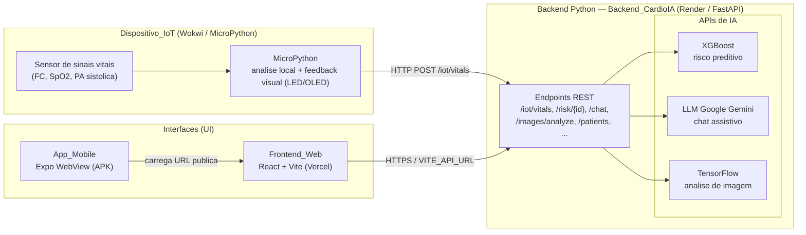

# FIAP - Faculdade de Informática e Administração Paulista

<p align="center">
<a href= "https://www.fiap.com.br/"></a>
</p>

<br>

# 🫀 CardioIA — Fase 7: Horizontes Inteligentes

**MVP Final — Unificação da Plataforma_CardioIA (Web + Mobile + IoT + IA)**

## Descrição do Projeto

A **Plataforma_CardioIA** é a integração funcional dos módulos desenvolvidos ao longo das fases
anteriores em um único MVP publicado em ambientes profissionais. Na **Fase 7 (Horizontes
Inteligentes)** o foco deixa de ser a construção de novas funcionalidades de domínio e passa a ser
a **unificação, publicação e demonstração** ponta a ponta da solução.

A plataforma é composta por quatro camadas que se comunicam entre si:

- **Backend_CardioIA** — serviço FastAPI (`backend/`) que expõe os endpoints REST e orquestra os
  três motores de IA: **XGBoost** (risco preditivo), **LLM Google Gemini** (chat assistivo) e **TensorFlow**
  (análise de imagem). Publicado no **Render** a partir do Dockerfile existente.
- **Frontend_Web** — aplicação **React 19 + Vite** (`frontend/`) que consome o backend público via
  `VITE_API_URL`, com **Login_Mock** e fallback para dados mock quando o backend está indisponível.
  Publicado na **Vercel** com CI/CD por push e roteamento SPA.
- **App_Mobile** — aplicativo **Android (Expo + react-native-webview)** (`mobile/`) que carrega a URL
  pública do Frontend_Web. Distribuído como **APK** gerado pelo **EAS Build** (perfil `preview`).
- **Dispositivo_IoT** — simulação **MicroPython no Wokwi** (`iot/`) que lê sinais vitais, faz análise
  local com feedback visual (LED/OLED) e envia os dados ao endpoint `/iot/vitals` do backend.

> Projeto acadêmico da FIAP — **Grupo 30**. Escopo restrito ao fechamento da rubrica de avaliação
> (URLs funcionais, build mobile, unificação do backend, IoT no Wokwi, diagrama, README e relatório).

---

## Grupo 30

### 👨‍🎓 Integrantes

- [Ana Beatriz Duarte Domingues](https://www.linkedin.com/in/)
- [Junior Rodrigues da Silva](https://www.linkedin.com/in/jrsilva051/)
- [Carlos Emilio Castillo Estrada](https://www.linkedin.com/in/)

### 👩‍🏫 Professores

**Tutor(a):** [Lucas Gomes Moreira](https://www.linkedin.com/company/inova-fusca)
**Coordenador(a):** [André Godoi Chiovato](https://www.linkedin.com/company/inova-fusca)

---

## 🔗 Acessos Rápidos (Entregáveis)

> ⚠️ **Atenção, Grupo 30:** os itens abaixo dependem de ações manuais (deploy, EAS Build, publicação
> no Wokwi). Substitua os placeholders pelos valores reais antes da entrega.

| Entregável | Acesso |
|---|---|
| 🌐 **Frontend_Web (Vercel)** | `https://<seu-projeto>.vercel.app` *(substituir pela URL real)* |
| ⚙️ **Backend_CardioIA (Render)** | `https://<seu-servico>.onrender.com` *(substituir pela URL real)* |
| 📱 **APK (EAS Build)** | `https://expo.dev/artifacts/<link-do-apk>` *(substituir pelo link real)* |
| 🔌 **Dispositivo_IoT (Wokwi)** | https://wokwi.com/projects/464629362761551873 |
| 🎬 **Vídeo de Demonstração** | `https://youtu.be/<id-do-video>` *(substituir pelo link real)* |

### 📲 QR Code do APK

Inclua aqui o QR Code que aponta para o link do APK acima, para o Avaliador instalar no dispositivo
Android:

<!-- Substitua pelo caminho real da imagem do QR Code após gerar o build no EAS. -->
<!-- Exemplo:  -->

`[ QR Code do APK — inserir imagem em docs/prints/qrcode-apk.png ]`

---

## 🏗️ Diagrama de Arquitetura

O **Diagrama_Arquitetura** representa o fluxo de dados exigido pela rubrica:
**Sensor → MicroPython → Backend Python → APIs de IA → UI**. O artefato reutilizável completo
(com legenda dos componentes) está em [`docs/diagrama-arquitetura.md`](docs/diagrama-arquitetura.md).



---

## 🖼️ Prints dos Deploys

Inclua aqui as capturas de tela dos deploys bem-sucedidos (R8.5). Salve as imagens em
`docs/prints/` e referencie-as conforme os exemplos abaixo.

**Deploy do Frontend_Web na Vercel:**

<!--  -->
`[ Print do dashboard de deploy da Vercel — inserir em docs/prints/deploy-vercel.png ]`

**Deploy do Backend_CardioIA no Render:**

<!--  -->
`[ Print do serviço Web Service no Render (status Live) — inserir em docs/prints/deploy-render.png ]`

---

## 💻 Execução Local

Pré-requisitos gerais: **Git**, **Python 3.10+**, **Node.js 18+** e (para o mobile) **npm**/`npx` com a CLI do Expo.

### 🐳 Opção recomendada: Docker Compose (backend + frontend)

A forma mais simples de subir o ambiente completo, sem se preocupar com versões de dependências
(o backend usa TensorFlow/XGBoost com versões fixas, isoladas no container):

```bash
# 1. configure a chave do Gemini no backend
copy backend\.env.example backend\.env   # Windows  (cp no Linux/macOS)
# edite backend/.env e defina GEMINI_API_KEY (gere em https://aistudio.google.com/apikey)

# 2. suba os dois serviços
docker compose up --build
```

- Backend: `http://localhost:8000` (docs em `/docs`)
- Frontend: `http://localhost:5173`
- O `docker-compose.yml` usa `USE_STUBS=0` (motores de IA reais). Para testes rápidos sem os
  modelos pesados, troque para `USE_STUBS=1`.

> Para parar: `docker compose down`. Após alterar `backend/.env`, recrie o container com
> `docker compose up -d --force-recreate backend` (um `restart` não relê o arquivo de ambiente).

Alternativamente, rode cada serviço manualmente:

### 1️⃣ Backend_CardioIA (FastAPI)

```bash
cd backend

# (opcional) criar e ativar um ambiente virtual
python -m venv .venv
# Windows
.venv\Scripts\activate
# Linux/macOS
source .venv/bin/activate

# instalar dependências
pip install -r requirements.txt

# configurar variáveis de ambiente
copy .env.example .env        # Windows
# cp .env.example .env        # Linux/macOS
# edite .env e defina GEMINI_API_KEY (a chave é usada APENAS pelo backend)

# iniciar a API (porta 8000)
uvicorn app.main:app --reload --host 0.0.0.0 --port 8000
```

Verifique a saúde da API: acesse `http://127.0.0.1:8000/health` (deve retornar `{"status": "ok"}`)
e a documentação interativa em `http://127.0.0.1:8000/docs`.

### 2️⃣ Frontend_Web (React + Vite)

```bash
cd frontend

# instalar dependências
npm install

# configurar variáveis de ambiente
copy .env.example .env        # Windows
# cp .env.example .env        # Linux/macOS
# para uso local, defina: VITE_API_URL=http://127.0.0.1:8000

# iniciar o servidor de desenvolvimento (porta 5173)
npm run dev
```

Acesse `http://localhost:5173`. Realize o **Login_Mock** (qualquer credencial com os campos
preenchidos concede acesso). Se o backend estiver indisponível, a aplicação exibe os dados mock de
fallback. Para gerar o build de produção: `npm run build` (saída em `dist/`).

### 3️⃣ App_Mobile (Expo WebView)

```bash
cd mobile

# instalar dependências
npm install

# iniciar o Expo (escaneie o QR Code com o app Expo Go ou abra um emulador)
npx expo start
```

O `mobile/App.js` carrega a URL pública do Frontend_Web na Vercel através do
`react-native-webview`. Ajuste a URL no `App.js` caso queira apontar para o frontend local.

**Gerar o APK (EAS Build):**

```bash
npm install -g eas-cli
eas login
eas build -p android --profile preview
```

O perfil `preview` (`mobile/eas.json`) produz um **APK** instalável. Ao finalizar, o EAS fornece o
link/QR Code do artefato — atualize a seção [Acessos Rápidos](#-acessos-rápidos-entregáveis).

### 4️⃣ Dispositivo_IoT (Wokwi / MicroPython)

O código do dispositivo está em [`iot/main.py`](iot/main.py) e o circuito em
[`iot/diagram.json`](iot/diagram.json). Para executar:

1. Abra o [Wokwi](https://wokwi.com) e crie um projeto MicroPython (ESP32).
2. Copie o conteúdo de `iot/main.py` e de `iot/diagram.json` para o projeto.
3. Ajuste a variável `API_URL` em `main.py` para a URL pública do Backend_CardioIA no Render.
4. Execute a simulação: o dispositivo lê os sinais vitais, aciona o feedback visual (LED/OLED) quando
   um valor está fora da faixa e envia o payload via `HTTP POST /iot/vitals`.

> O projeto já está publicado no Wokwi: https://wokwi.com/projects/464629362761551873
> Ele também aparece **incorporado (embed) dentro da própria plataforma**, na página
> **Arquitectura** (`/architecture`) do Frontend_Web.

---

## 🧱 Estrutura do Projeto

```
Fase7_CardioAI_HorizontesInteligentes/
├── backend/                 # Backend_CardioIA (FastAPI + motores de IA)
│   ├── app/                 # main.py, risk_engine, chat_engine, image_engine, models
│   ├── models/              # modelos treinados (.pkl, .h5) e scaler
│   ├── Dockerfile           # build usado no deploy do Render
│   ├── requirements.txt
│   └── test_smoke.py        # smoke/integração com TestClient
├── frontend/                # Frontend_Web (React 19 + Vite)
│   ├── src/                 # páginas, componentes, context (Login_Mock), services
│   ├── vercel.json          # rewrite SPA para a Vercel
│   └── .env.example         # VITE_API_URL
├── mobile/                  # App_Mobile (Expo WebView)
│   ├── App.js               # WebView carregando a URL da Vercel
│   ├── app.json             # android.package (domínio invertido)
│   └── eas.json             # perfil preview (APK)
├── iot/                     # Dispositivo_IoT (MicroPython / Wokwi)
│   ├── main.py
│   └── diagram.json
├── docs/                    # Documentação e entregáveis
│   ├── diagrama-arquitetura.md
│   ├── relatorio-tecnico.md
│   └── prints/              # capturas de deploy e QR Code (a adicionar)
├── docker-compose.yml
├── assets/                  # logo FIAP e imagens
└── README.md                # este arquivo
```

---

## 🔌 Endpoints do Backend

| Método | Rota | Descrição | Motor de IA |
|---|---|---|---|
| GET | `/health` | Health check (status) | — |
| GET | `/dashboard/summary` | Resumo do dashboard | — |
| GET | `/patients` | Lista de pacientes | — |
| GET | `/patients/{id}` | Detalhe de um paciente (404 se ausente) | — |
| GET | `/vitals/{id}` | Sinais vitais do paciente | — |
| GET | `/risk/{id}` | Predição de risco (`alto/moderado/bajo`) | XGBoost |
| GET | `/monitoring/summary` | Resumo de monitoramento | — |
| POST | `/chat` | Chat assistivo | LLM Google Gemini |
| POST | `/iot/vitals` | Recebe sinais vitais do Dispositivo_IoT | — |
| POST | `/images/analyze` | Análise de imagem | TensorFlow |

---

## 🔐 Segurança da Chave de API

- A **Chave_Gemini** (`GEMINI_API_KEY`) é usada **exclusivamente pelo Backend_CardioIA**, nunca pelo
  Frontend_Web.
- Os arquivos `.env` estão no `.gitignore` e **não** são versionados. Apenas os `*.env.example` com
  placeholders fazem parte do repositório.
- Em produção, configure `GEMINI_API_KEY` (e opcionalmente `GEMINI_MODEL`) como **variável de ambiente do serviço no Render**.
- A chave do Google Gemini é gerada gratuitamente no [Google AI Studio](https://aistudio.google.com/apikey).
- Caso uma chave tenha sido exposta anteriormente, **revogue-a** e gere uma nova.

---

## 🎬 Vídeo de Demonstração

O roteiro da demonstração fim a fim (≤ 5 min) está em [`docs/roteiro-video.md`](docs/roteiro-video.md)
e cobre: Login_Mock, navegação no Frontend_Web, chat com LLM, predição de risco, análise de imagem,
envio de dados pelo Dispositivo_IoT e o App_Mobile carregando o Frontend_Web.

🔗 Vídeo: `https://youtu.be/<id-do-video>` *(substituir pelo link real)*

---

## 📄 Relatório Técnico

A fonte do **Relatorio_Tecnico** (≤ 5 páginas) está em
[`docs/relatorio-tecnico.md`](docs/relatorio-tecnico.md), incluindo o Diagrama_Arquitetura, o fluxo
de dados (IoT → Backend → IA → UI) e a identificação dos integrantes do Grupo 30.

---

## 📋 Licença

<p xmlns:cc="http://creativecommons.org/ns#" xmlns:dct="http://purl.org/dc/terms/"><a property="dct:title" rel="cc:attributionURL" href="https://github.com/agodoi/template">MODELO GIT FIAP</a> por <a rel="cc:attributionURL dct:creator" property="cc:attributionName" href="https://fiap.com.br">Fiap</a> está licenciado sobre <a href="http://creativecommons.org/licenses/by/4.0/?ref=chooser-v1" target="_blank" rel="license noopener noreferrer" style="display:inline-block;">Attribution 4.0 International</a>.</p>
