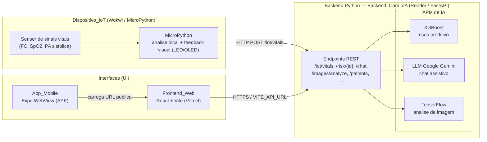

# Diagrama de Arquitetura — CardioIA (Fase 7)

Artefato reutilizável do **Diagrama_Arquitetura** da plataforma CardioIA. Este diagrama é
referenciado pelo `README.md` (R8.4) e pelo Relatório Técnico (`docs/relatorio-tecnico.md`, R9.2).

## Fluxo de Dados Fim a Fim

Representa a sequência exigida pela rubrica: **Sensor → MicroPython → Backend Python → APIs de IA → UI** (R7.1),
identificando os motores de IA na camada de APIs de IA (R7.2) e o Frontend_Web e o App_Mobile como camada de interface (R7.3).

## Legenda dos Componentes

| Camada | Componente | Tecnologia | Responsabilidade |
|---|---|---|---|
| Sensor | Sensor de sinais vitais | Wokwi (simulado) | Leitura de FC, SpO2 e PA sistólica |
| MicroPython | Dispositivo_IoT | MicroPython | Análise local, feedback visual (LED/OLED) e envio HTTP |
| Backend Python | Backend_CardioIA | FastAPI (Render) | Exposição dos endpoints REST e orquestração dos motores de IA |
| APIs de IA | XGBoost | scikit-learn / XGBoost | Predição de risco cardiovascular (`/risk/{id}`) |
| APIs de IA | LLM Google Gemini | Google Gemini API | Chat assistivo (`/chat`) |
| APIs de IA | TensorFlow | TensorFlow / Keras | Análise de imagem (`/images/analyze`) |
| UI | Frontend_Web | React 19 + Vite (Vercel) | Interface web consumindo o backend via `VITE_API_URL` |
| UI | App_Mobile | Expo + react-native-webview | Aplicativo Android que carrega a URL pública do Frontend_Web |

## Como reutilizar

- O bloco Mermaid acima pode ser copiado diretamente para o `README.md` e para a fonte do Relatório Técnico.
- Plataformas como GitHub renderizam Mermaid nativamente em arquivos `.md`.
- Para exportar como imagem (PNG/SVG) para o PDF, utilize o [Mermaid Live Editor](https://mermaid.live) colando o conteúdo do bloco.
