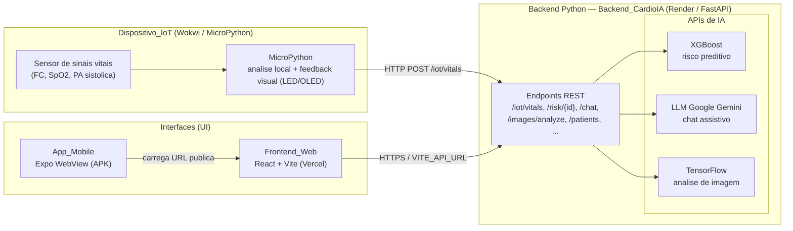

# Relatório Técnico — CardioIA (Fase 7: Horizontes Inteligentes)

**Disciplina:** FIAP — Fase 7 (Horizontes Inteligentes)
**Grupo:** 30
**Projeto:** Plataforma CardioIA — Sistema Preditivo Cardiológico com IA e IoT

> Fonte em Markdown do **Relatorio_Tecnico**. Para a entrega, exporte este documento
> para **PDF com no máximo 5 páginas** (R9.1). O diagrama Mermaid renderiza nativamente
> no GitHub; para o PDF, exporte a imagem pelo [Mermaid Live Editor](https://mermaid.live).

---

## 1. Visão Geral da Solução

A **Plataforma CardioIA** é um MVP de triagem cardiológica que integra, de ponta a ponta,
um dispositivo IoT simulado, um backend de IA e interfaces web e mobile. A solução unifica
os módulos das fases anteriores em uma entrega profissional publicada em ambientes de nuvem
(Vercel e Render), com aplicativo Android distribuído via APK (Expo/EAS Build).

A plataforma é composta por quatro camadas:

- **Dispositivo_IoT** — simulação MicroPython no Wokwi que lê sinais vitais, executa análise
  local e envia os dados ao backend.
- **Backend_CardioIA** — serviço FastAPI (hospedado no Render) que expõe os endpoints REST e
  orquestra os três motores de IA.
- **APIs de IA** — XGBoost (risco preditivo), LLM Google Gemini (chat assistivo) e TensorFlow
  (análise de imagem).
- **Interfaces (UI)** — Frontend_Web (React + Vite, na Vercel) e App_Mobile (Expo WebView).

---

## 2. Diagrama de Arquitetura

O diagrama abaixo representa a sequência exigida: **Sensor → MicroPython → Backend Python →
APIs de IA → UI** (R7.1), identificando os motores de IA (R7.2) e as interfaces de usuário
(R7.3). O artefato reutilizável encontra-se em [`docs/diagrama-arquitetura.md`](./diagrama-arquitetura.md).

---

## 3. Fluxo de Dados (IoT → Backend → IA → UI)

O fluxo descreve a comunicação entre o Dispositivo_IoT, o Backend_CardioIA, os motores de IA
e as interfaces de usuário (R9.3):

1. **Sensor → MicroPython.** O Dispositivo_IoT no Wokwi realiza a leitura simulada de sinais
   vitais (frequência cardíaca, SpO2 e pressão arterial sistólica).
2. **Análise local + feedback visual.** O MicroPython classifica cada leitura como normal ou
   alterada (ex.: `spo2 < 92` ou `heart_rate > 110`) e aciona um feedback visual (LED/OLED)
   quando a leitura está fora da faixa.
3. **MicroPython → Backend.** Ao final de cada ciclo, o dispositivo envia os sinais vitais via
   `HTTP POST /iot/vitals` para a URL pública do Backend_CardioIA, com payload compatível com
   o modelo `IoTVitalIn`.
4. **Backend → APIs de IA.** O backend FastAPI expõe os endpoints REST e orquestra os motores:
   - `GET /risk/{id}` → **XGBoost** retorna a predição de risco (`alto`, `moderado`, `bajo`).
   - `POST /chat` → **LLM Google Gemini** retorna a resposta do assistente conversacional.
   - `POST /images/analyze` → **TensorFlow** retorna o rótulo e a probabilidade da análise.
5. **Backend → UI.** O Frontend_Web consome os endpoints via `VITE_API_URL` sobre HTTPS e
   apresenta dashboard, pacientes, sinais vitais, risco, chat e análise de imagem. Caso o
   backend esteja indisponível (cold start do Render), o frontend degrada graciosamente
   exibindo dados mock de fallback.
6. **UI Mobile.** O App_Mobile (Expo WebView) carrega a URL pública do Frontend_Web na Vercel,
   refletindo a mesma experiência em um dispositivo Android.

### Endpoints principais do Backend_CardioIA

| Método | Rota | Motor / Resultado |
|---|---|---|
| GET | `/health` | Status do serviço |
| GET | `/dashboard/summary` | Resumo de pacientes |
| GET | `/patients`, `/patients/{id}` | Dados de pacientes |
| GET | `/vitals/{id}` | Sinais vitais do paciente |
| GET | `/risk/{id}` | XGBoost — risco preditivo |
| GET | `/monitoring/summary` | Resumo de monitoramento |
| POST | `/chat` | LLM Google Gemini — chat assistivo |
| POST | `/iot/vitals` | Ingestão dos dados do IoT |
| POST | `/images/analyze` | TensorFlow — análise de imagem |

---

## 4. Stack Tecnológica

| Camada | Tecnologia | Hospedagem |
|---|---|---|
| Dispositivo_IoT | MicroPython | Wokwi (simulação) |
| Backend_CardioIA | Python + FastAPI | Render (Docker) |
| IA preditiva | XGBoost / scikit-learn | Backend_CardioIA |
| IA conversacional | LLM Google Gemini | API Google Gemini (via backend) |
| IA de imagem | TensorFlow / Keras | Backend_CardioIA |
| Frontend_Web | React 19 + Vite | Vercel |
| App_Mobile | Expo + react-native-webview | APK via EAS Build |

A **segurança da Chave_Gemini** é garantida mantendo a credencial exclusivamente no backend
(variável de ambiente no Render), nunca no bundle do frontend, com os arquivos `.env` fora do
versionamento.

---

## 5. Integrantes do Grupo 30

| Nome | Função |
|---|---|
| Ana Beatriz Duarte Domingues | Desenvolvimento / Integração |
| Junior Rodrigues da Silva | Desenvolvimento / Integração |
| Carlos Emilio Castillo Estrada | Desenvolvimento / Integração |

**Professores** — Tutor: Lucas Gomes Moreira · Coordenador: André Godoi Chiovato

> Caso a divisão de funções por integrante seja diferente, ajuste a coluna "Função" antes de
> exportar o PDF.
